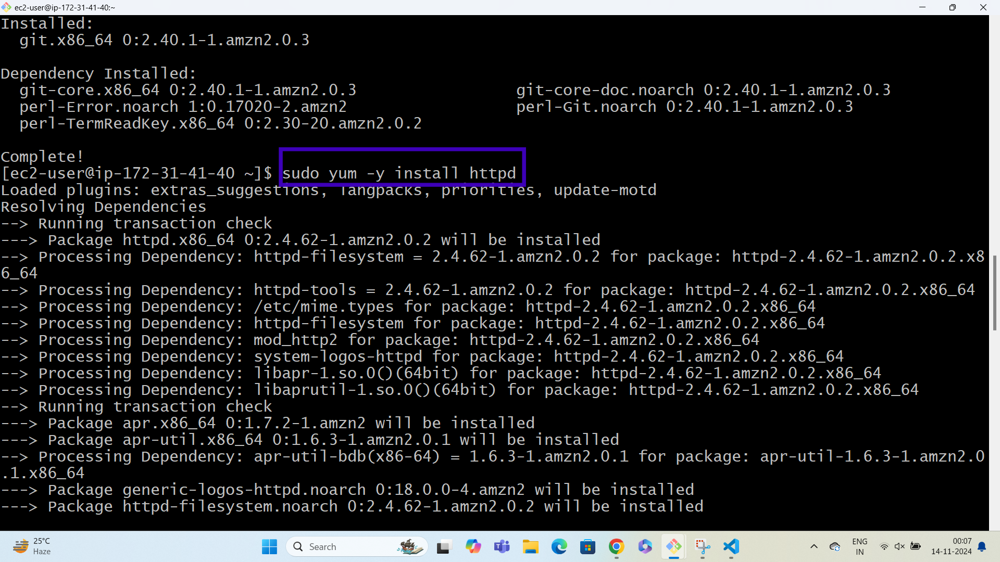
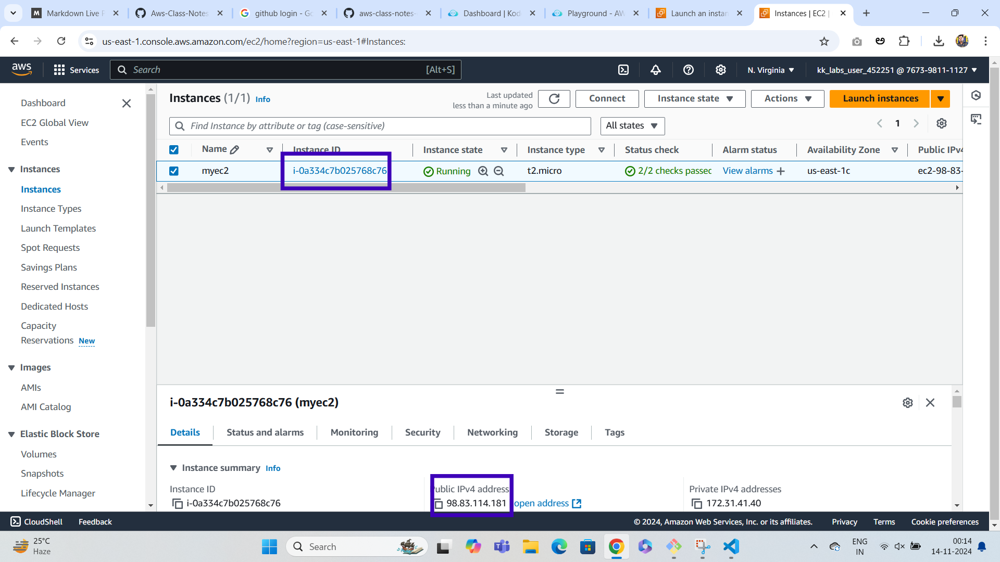

# Deploy Application on Ec2 Using Httpd as Web-Server

***

**HTTPd stands for Hypertext Transfer Protocol daemon. 
It usually is the main software part of an HTTP server better known as a web serverSome commonly used implementations are: Apache HTTP Server**

## LAB

### Step1: Create EC2 Instance

***

**open aws console and search for EC2 service and once the page displayed click on launch instance as shown below**

**once the launch an instance page is displayed give a name for ec2 and also select ami as shown below**

**select instance type as t2.micro and click on create new keypair button as shown below**

**After clicking on create new keypair select the options as shown below and click on create keypair button**

**After creating keypair go to network settings and click on edit button**

**click on add security group rule and select http as shown below**

**click on launch instance as shown below**

**click on the instanceid as shown below**

**select the checkbox of our ec2 instance and click on connect button**

**selectssh client and copy the sshcode as shown below**

**open terminal and give command like cd Downloads where you downloaded the keypair, once the directory changed to the downloads paste the ssh key and press enter then it will connect to the instance**

**Enter the commands as shown below in the terminal**

**once the above commands executed go to console and click on the instance we created and copy the public ip address and paste it in the browser to check if the website is deployed or not**

**our website is deployed**

