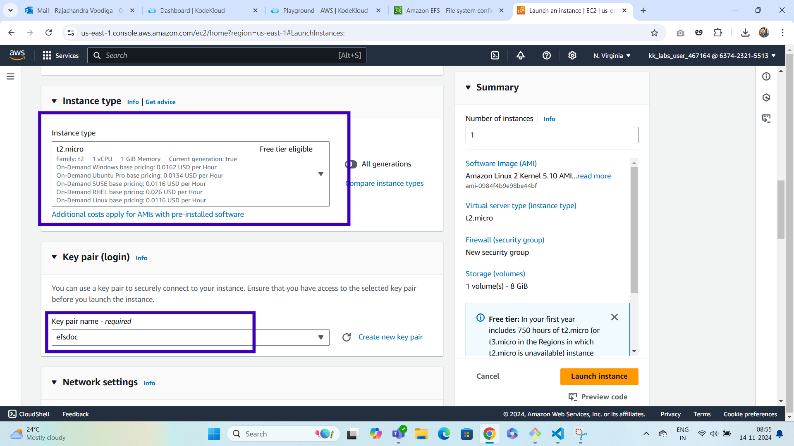
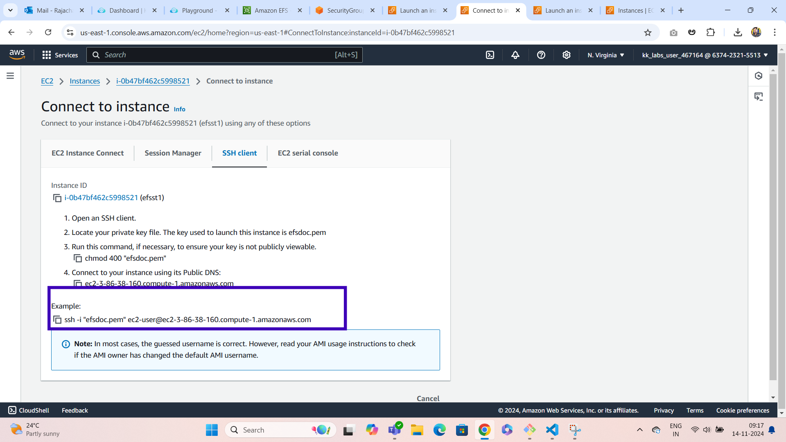
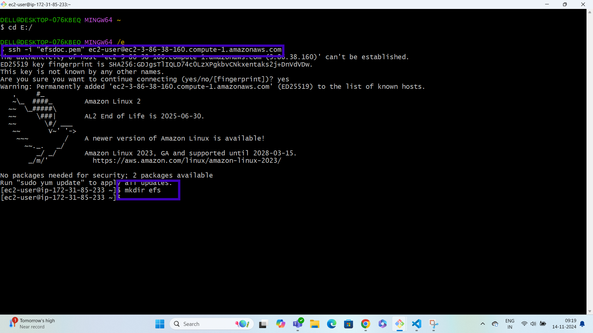

# EFS

**From the aforementioned list, EFS falls under the file storage category. EFS is a file-level, fully managed, storage provided by AWS (Amazon Web Services) that can be accessed by multiple EC2 instances concurrently. Just like the AWS EBS, EFS is specially designed for high throughput and low latency applications**

**EFS can be created using the EC2-Instance where it will be created in a specific region and distributed across multiple availability zones for the purpose of high availability and durability. You can choose the EFS based on the I/Ops you are going to perform**

### LAB

### Step1: search for efs service on aws console and click on Create File system
***

### Step2: give the name for efs and click on create button
***

### Step3: efs will be created and u can see the efs id

***
### Step4: search for ec2 service on aws console and click on launch instance

***
### Step5: Launch an instance page will be displayed give the name ec2 instance

***
### Step6: select ami,instance type and create keypair

### Step7: Add security group rule (ssh and http) and create launch instance button which will be right bottom

***
### Step8: ec2 st1 instance will be created

***
### Step9: search for vpc in console on left side menu click on security group and also click on security group button on right side top

***
### Step10: give the port 2049 in inbound rules

***
### Step11: click on create security group button

***
### Step12: Security group will be created

***
### Step13: go to efs select network

***
### Step14: click on manage button

***
### Step15: select the security groups and choose the security group what we created in before steps and click on save

### Step16: go to the ec2 instance we created and click on connect button and copy the ssh code

***
### Step17: go terminal and go to drive where u keypair is downloaded and paste the ssh code for connecting the instance

***
### Step18: make a directory efs

***
### Step19:go to efs which we created and click on attach a mount code will be displayed

***
### Step20: go to terminal where your ec2 instance created and make a directory efs and paste the mount code after that create a folder and file in efs folder

***

### Step21: Create ec2 instance 2 and click on connect button copy the ssh code

***

### Step22: go to the terminal and copy the ssh code and create ec2 connection and make directory efs and paste the efs mount code and go efs directory and check the folders and files

***