# AMI - Amazon Machine Image

**An Amazon Machine Image (AMI) is an image that provides the software that is required to set up and boot an Amazon EC2 instance. 
Each AMI also contains a block device mapping that specifies the block devices to attach to the instances that you launch. 
You must specify an AMI when you launch an instance.
The AMI must be compatible with the instance type that you chose for your instance. 
You can use an AMI provided by AWS, a public AMI, an AMI that someone else shared with you, or an AMI that you purchased from the AWS Marketplace.**

### LAB

### Step1: Select running Ec2

***
**Select running instance and click on actions dropdown as shown below**

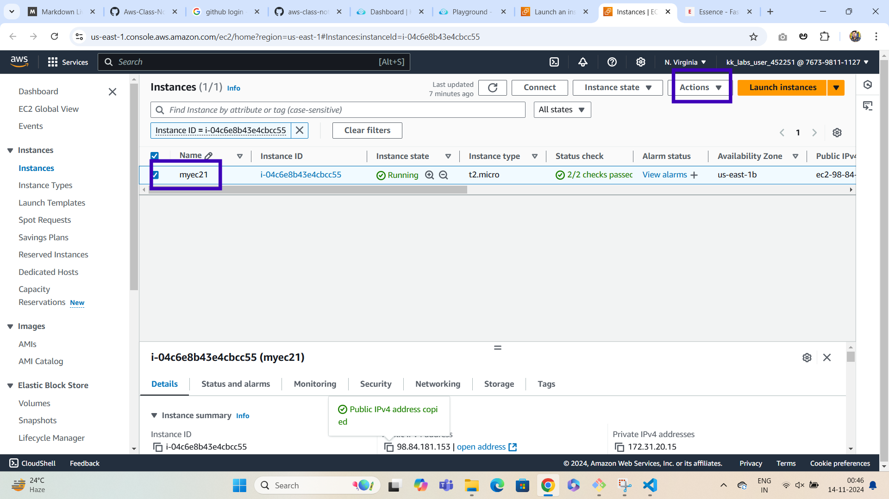

**In the drop down menu select images and templates**

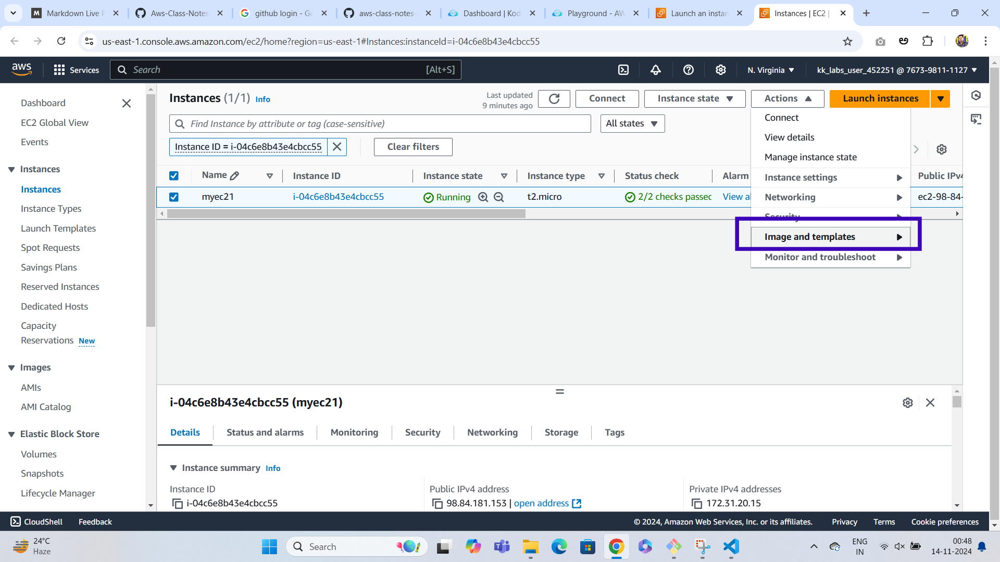

**click on create image**

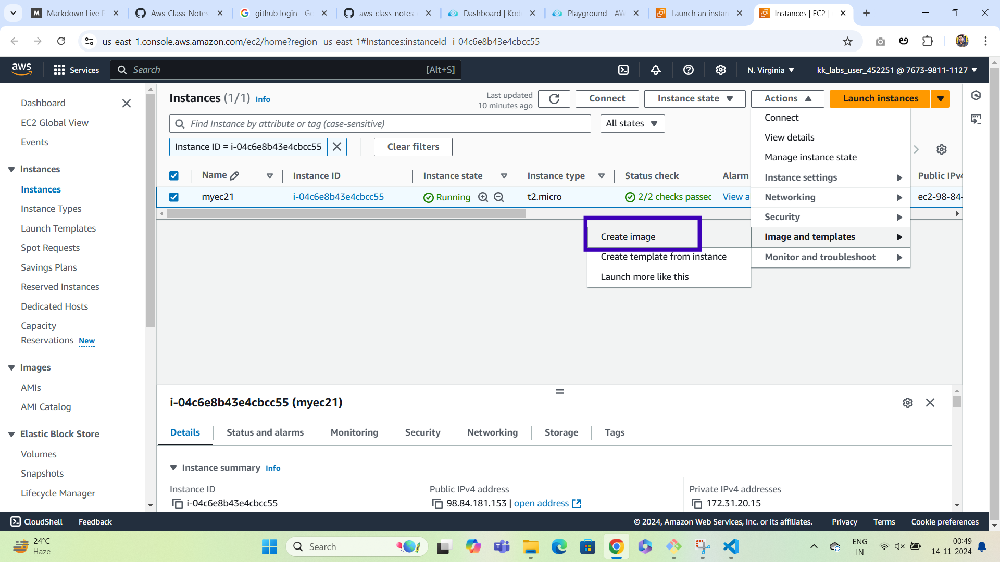

**In create images page give the name of ami and click on create image button**

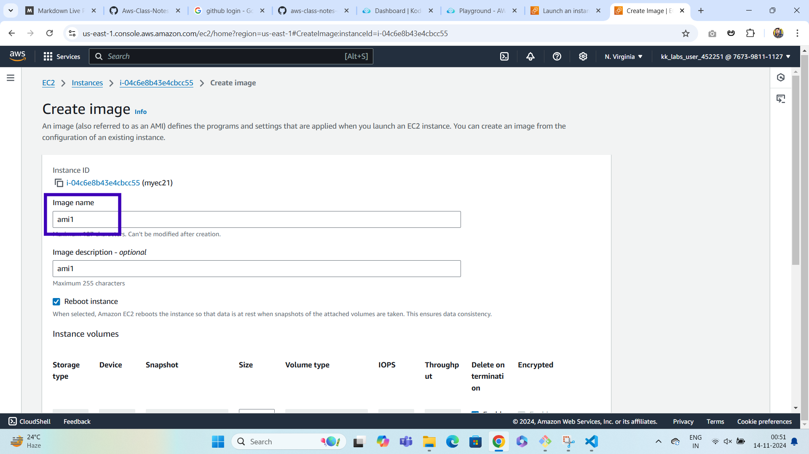

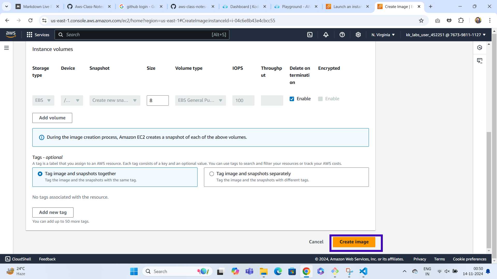

**click on created ami id as shown below**

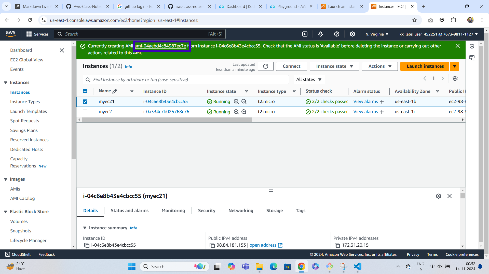

**select the ami and click on launch ami instance**

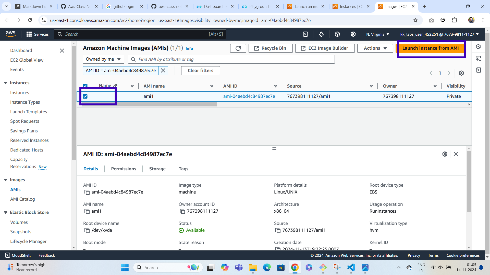

**on launch instance page give the ami name**

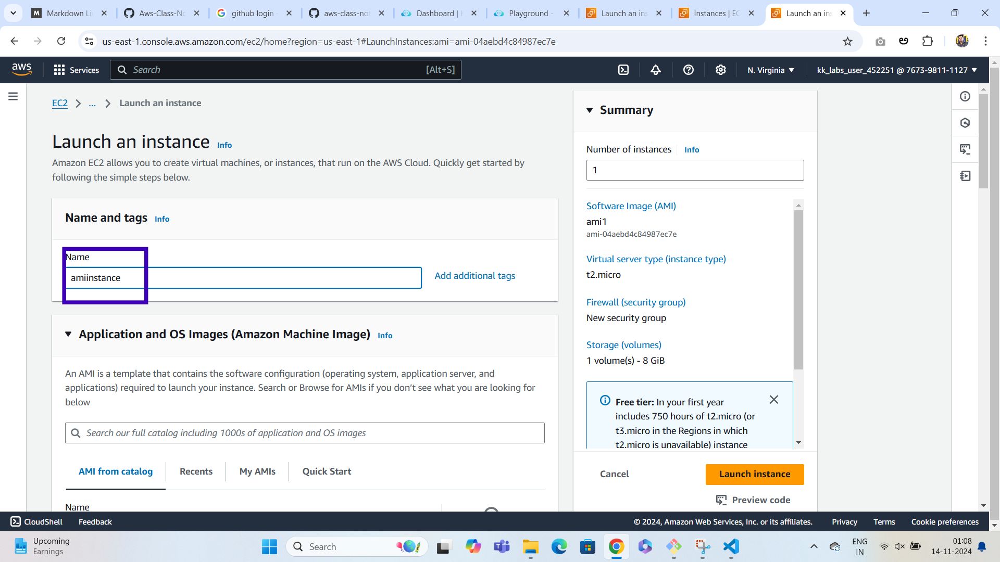

**go to network settings click on edit and configure security groups ssh and http**

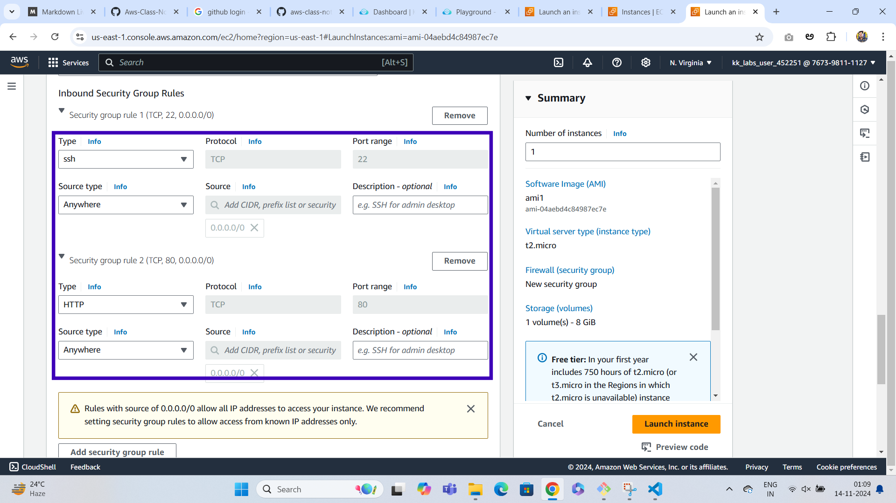

**click on launch instance button**

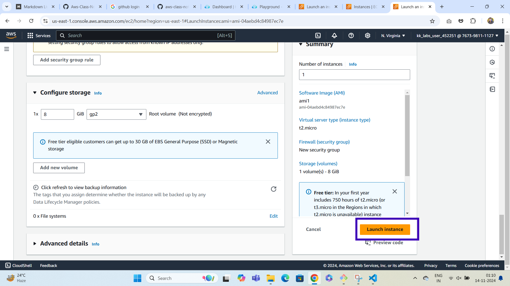

**click on ami id as shown below**
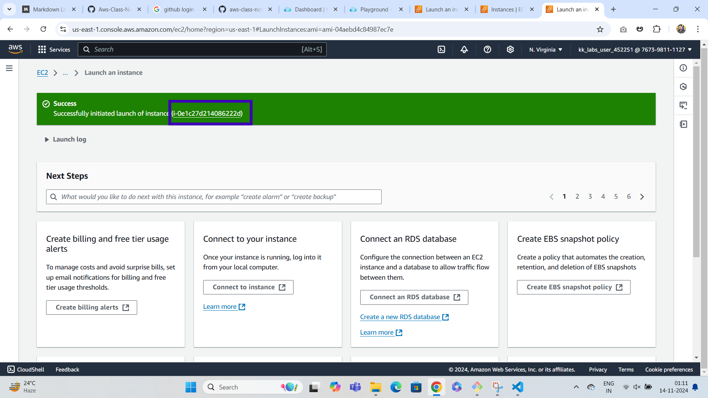

**select amiinstance and copy publicip**

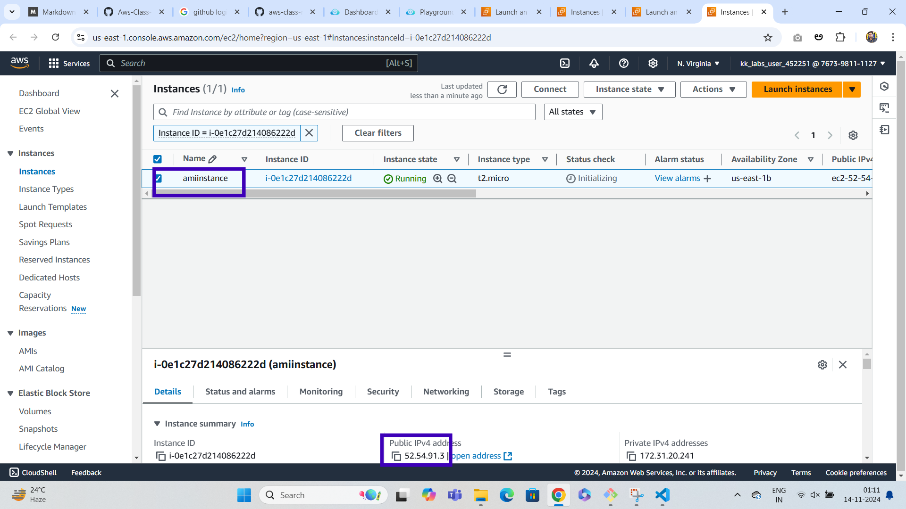

**paste and go publicip address in the browser website will be displayed**

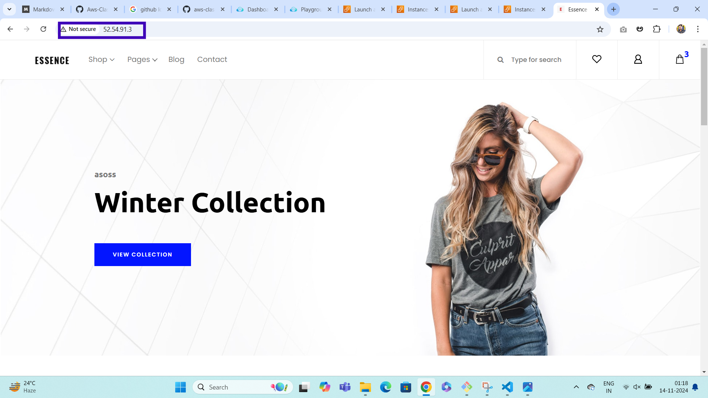