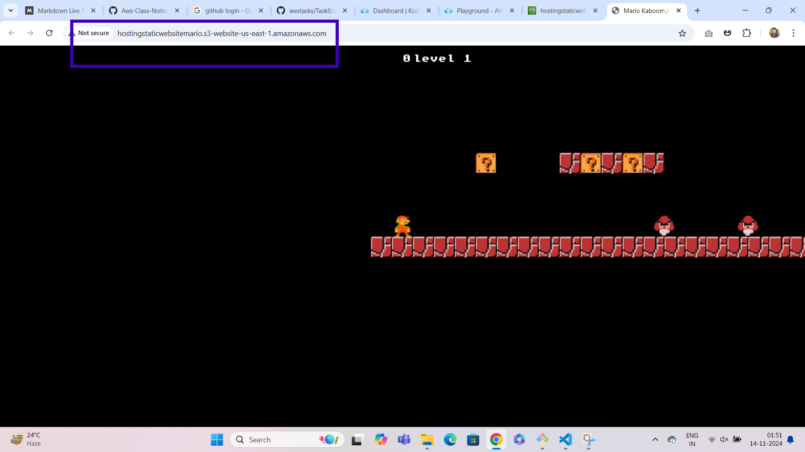

# S3 - Simple Storage Service 

**Amazon Simple Storage Service (Amazon S3) is an object storage service that offers industry-leading scalability, 
data availability, security, and performance. You can use Amazon S3 to store and retrieve any amount of data at any time, from anywhere**

### LAB

**create bucket**

**on create bucketpage give the unique bucketname**

**Enable Bucket versioning**

**savechanges and create bucket**

**select bucket and upload files and click on upload**

**go to properties and edit static webhosting**

**enable the staticwebhosting and give the document name as index.html and savechanges**

**go to permissions and uncheck the block public access and edit bucket policy and save changes**

**host the website with staticurl**
