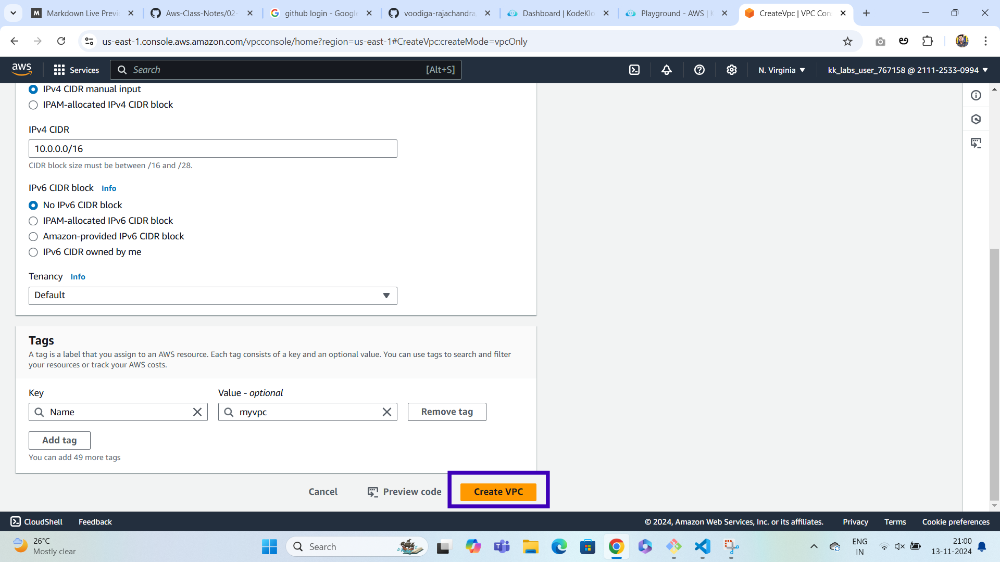
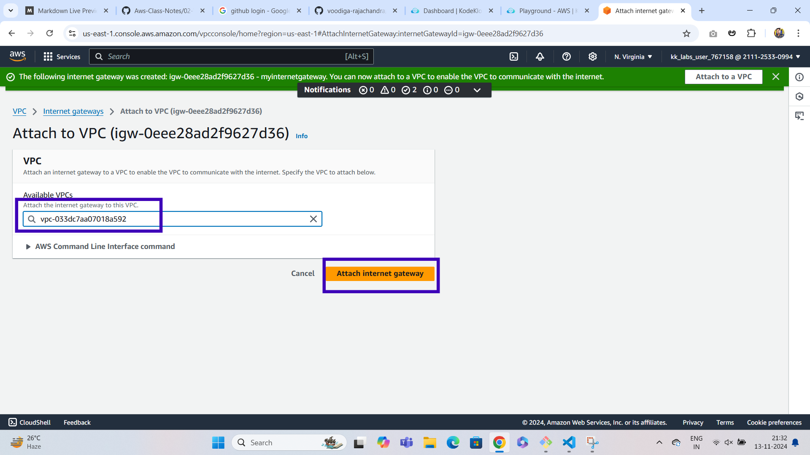
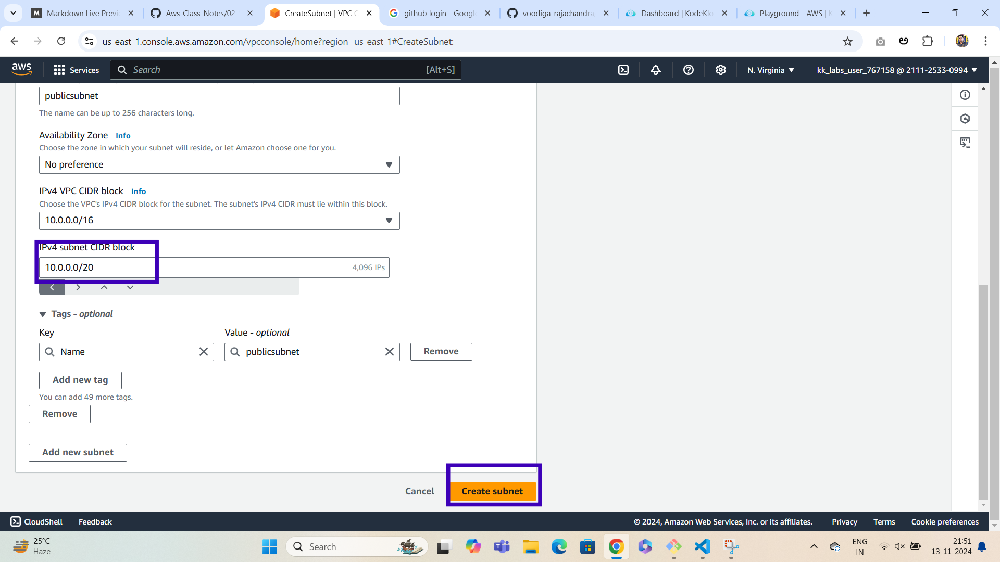

# VPC - Virtual Private Cloud
**With Amazon Virtual Private Cloud (Amazon VPC), you can launch AWS resources in a logically isolated virtual network that you've defined.
This virtual network closely resembles a traditional network that you'd operate in your own data center, with the benefits of using the scalable infrastructure of AWS.**

## LAB

### Step1: *Create VPC*
***
**Go to AWS Console and search for vpc service and click on create vpc**

**In vpc settings select following options**

**click on createVPC button**

**After clicking on create vpc button vpc will be created with specifications like vpcid and vpc name etc**

### Step2: *Internet Gateway*

***
**An internet gateway is a horizontally scaled, redundant, and highly available VPC component that allows communication between your VPC and the internet.It supports IPv4 and IPv6 traffic. It does not cause availability risks or bandwidth constraints on your network traffic.**

**on the left side there will be vpc dashboard menu where u need to click on Internet gateway.Once you click the Internetgateway right side there will be a button called Create internet gateway**

**once you clicked on Create internet gateway button a page will display and in that page give the internet gateway name and click on the create internet gateway button**

**once you done with the above instructions a page will display which shows internet gateway id,name and on the right side there will be a button called attachtovpc click on that button**

**once you clicked on attachtovpc button a page will display as shown below where u need to select the vpc what we created and click on attach internet gateway button**

**once you click on attach to vpc button a page will display as shown below where internetgateway id,name and is it attached to the vpc or not will be displayed**

### Step3: Create Subnets

***

**A subnet, or subnetwork, is a network inside a network.
Subnets make networks more efficient. Through subnetting,
network traffic can travel a shorter distance without passing through unnecessary routers to reach its destination**

**once you finish with the internet gateway in the vpc dashboard menu which will be on left side go to subnets and click on it and a page will display which shows create subnet button on right side click on it**

**once you click on create subnet button a page will display
where you need to select the vpc option and also give the subnet name (publicsubnet),mention the cidr range and click on create subnet button**

**Once you click on create subnet button a page will display as shown below where it displays public subnet is created and you need to click on create subnet button on right side for creating private subnet**

**Once you click on create subnet button a page will display as shown below where you need to select our vpc and subnetname(privatesubnet) mention the cidr range and click on create subnet button**

**once you done above process a page will display which shows that private subnet is created**

### Step4: Create Route Tables

***

**A route table contains a set of rules, called routes, that determine where network traffic from your subnet or gateway is directed.**

**In the vpc dashboard which is on left side click on route tables and a page will display where it shows create route table so click on it**

**In the create route table page give the name public routetable and select our vpc then click on create route table button**

**once you created the public route table that page will display options like routes and click on edit routes to attach internet gateway**

**when u click on edit routes a page will display where u need to click on addroute button and select the internet gateway and click on save changes button(proceed as shown in the image below)**

**once you completed the above process go to subnet associations and click on edit subnet associations**

**In edit subnet associations page select public subnet and click on save associations button**

**once again do the same process of creating rout table but this time it is for private route table without attaching internetgateway**

**In the create route table page give the route table name as privateroutetable and select our vpc and click on createroutetable button**

**once you created privateroutetable click on subnet associations and click on edit subnet associations and select private subnet and click on save associations**

***
### VPC Creation with subnets,internetgateway,routetables is done

***